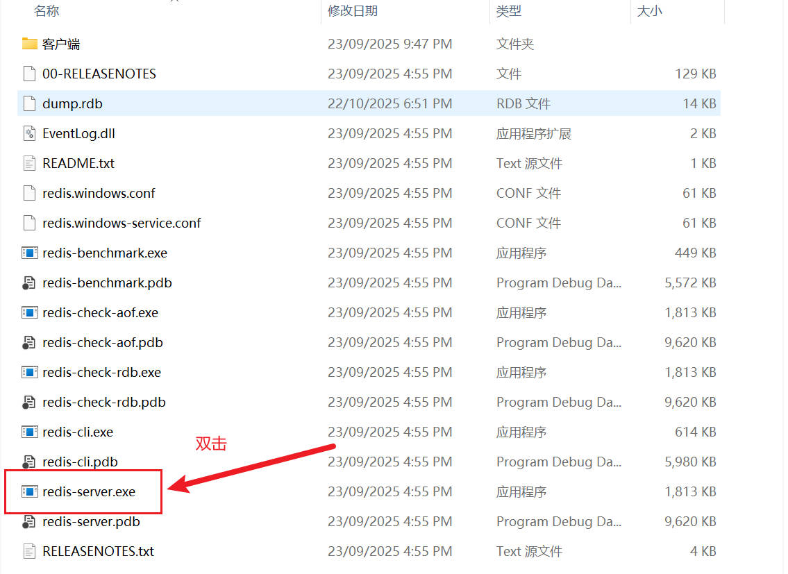
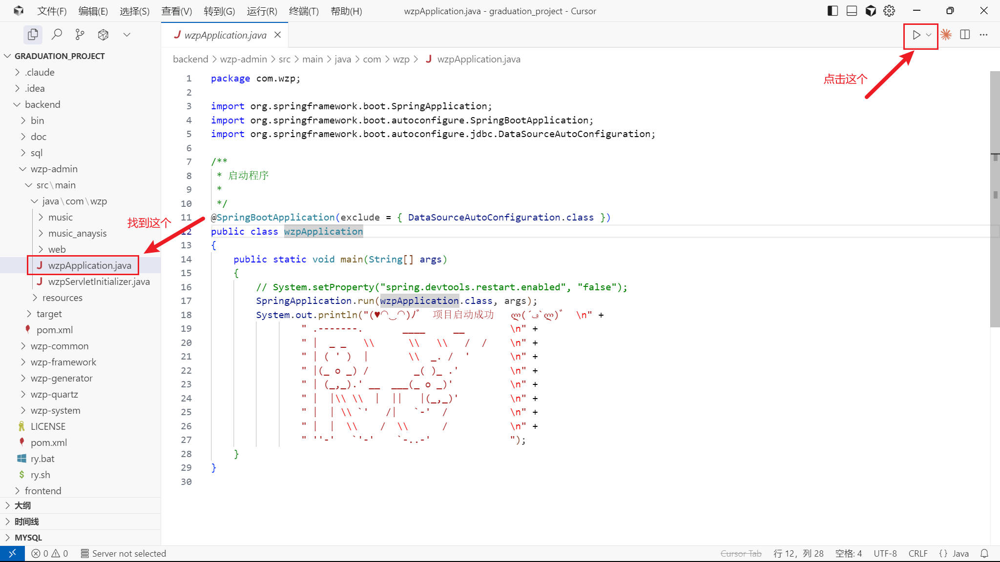
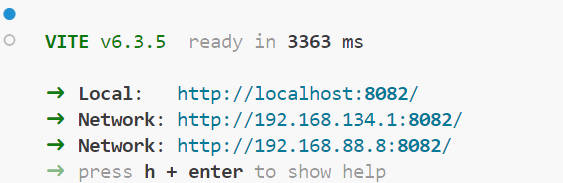
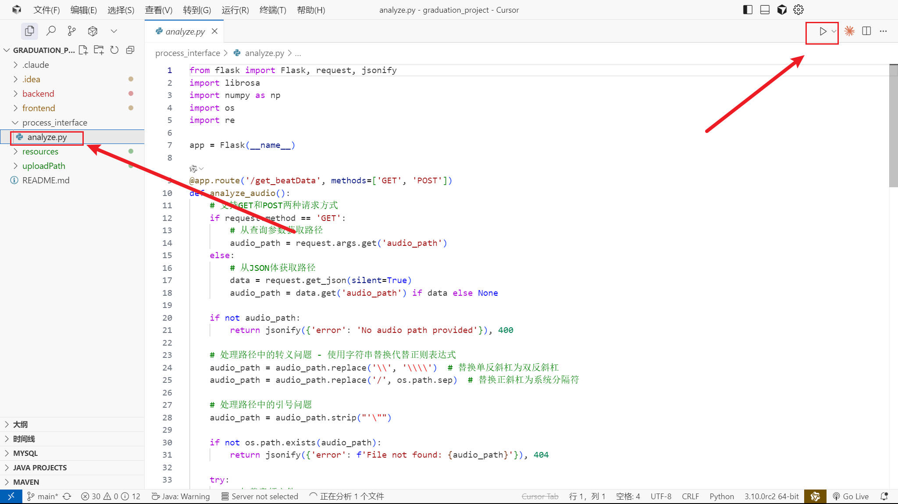
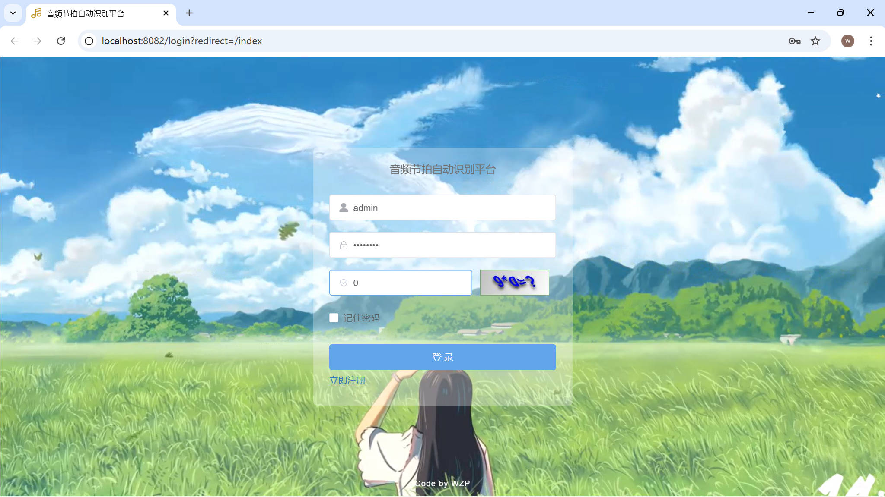
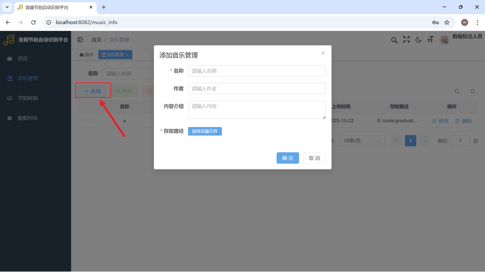
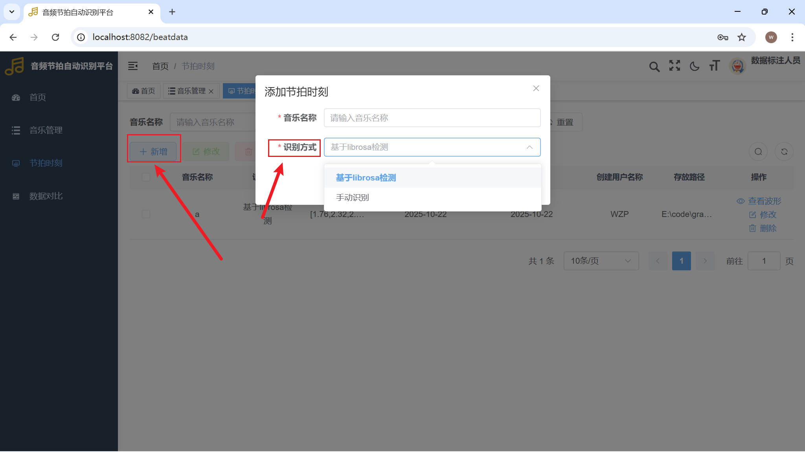
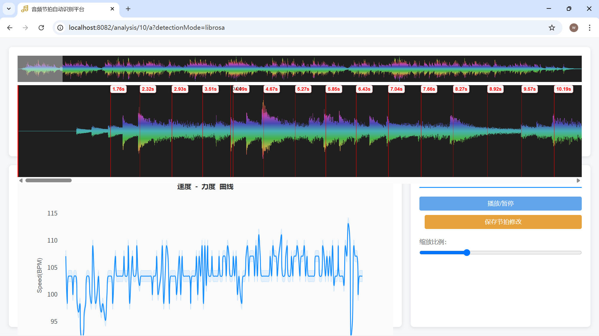

1. 打开redis(在D:\Redis目录下)

    

2. 把`graduation_project`文件夹拖入VScode图标打开

3. 运行后端程序E:\code\graduation_project\backend\wzp-admin\src\main\java\com\wzp\wzpApplication.java

    

4. 按window+r,输入cmd,打开终端，输入`cd C:\Users\guoda\Desktop\graduation_project\frontend`后，运行前端代码`npm run dev`后回车，等待一段时间直到出现这个。

    

    

5. 运行E:\code\graduation_project\process_interface下的所有算法代码

    

6. 在浏览器打开网址`http://localhost:8082/`

    

7. 数据标注人员账户：annotator，密码：123456；超级用户账户admin,密码：admin123;我推荐老师用数据标注人员账户，这样我好区分。

8. 音乐管理页面。点击新增按钮添加音频文件信息。

    

9. 节拍时刻页面。点击新增按钮，选择手动识别（没有节拍时刻标签）或者基于librosa检测自动识别（有节拍时刻标签，可能需要微调）

    

10. 点击查看波形，进入分析页面。点击“asdw”中的任意一个键都可以插入节拍时刻标签。鼠标左键可拖动节拍时刻标签或者靠近按“<-”或“->”键移动节拍时刻标签（点击一次移动0.01s,紧按可加速），鼠标右键可选择删除节拍时刻标签。

    

11. 数据对比页面。可选择多个同一音频的节拍时刻数据进行比对，目前不支持在这里修改。不同音频的数据不能进行比较！

    

    